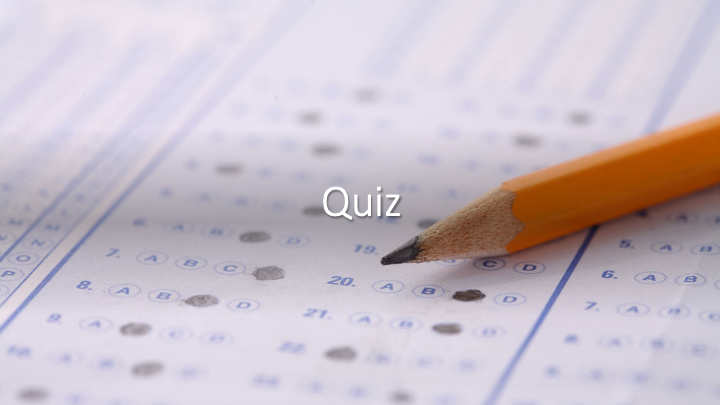

# Engelsk-språklig applikasjon

## Behovsanalyse

#### Hvilke utfordringer har brukeren?
#### Hvilke interesser har brukeren?

Brukeren har downsyndrom og har vanskelig for å lære seg språk, spesielt engelsk, 
Hun observerer at engelsk er et nyttig språk, som kommer igjen i mange sammenhenger.
Brukeren liker spill og har konkurranse-instinkt. Motivasjonen øker når man ser fremgang i læringen,
i form av poeng og økt mestringsfølelse.

## Applikasjons-analyse

#### Hva er applikasjonen?
#### Husk bilder og illustrasjoner

Applikasjonen er et TRUE-FALSE spill, som skal gi brukeren ett riktig svar og et feil svar.
Brukeren starter med 0 poeng og får ett poeng for riktig svar. 
Når alle 10 spørsmålene er stilt, får man en poeng-Score, og Muligheten til å starte igjen.

1. Første side.

